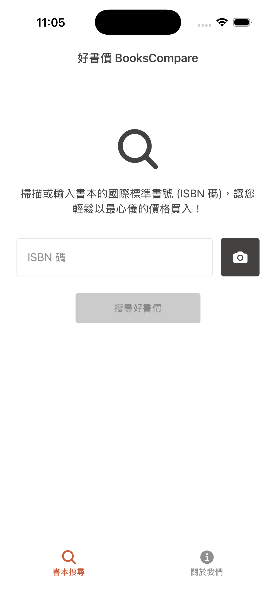
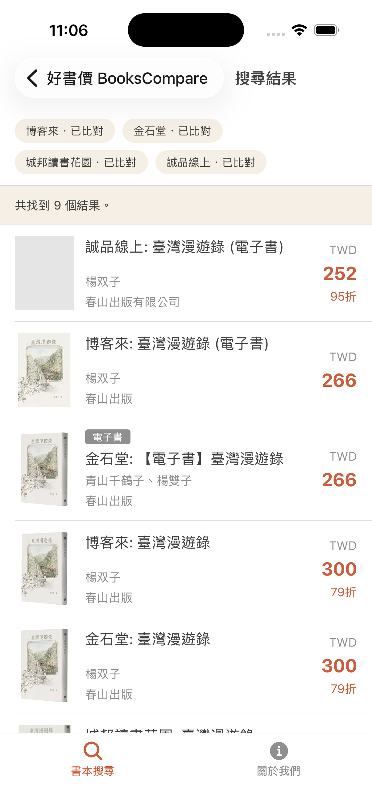
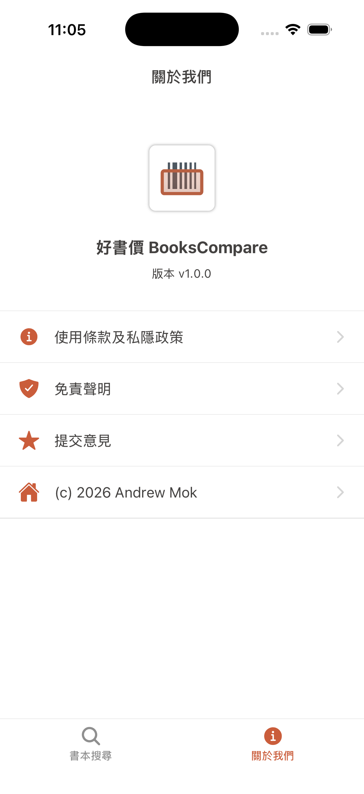

<p align="center">
  
</p>

<h1 align="center">BooksCompare</h1>

<p align="center">
  <strong>An iOS app for one-click price comparison across Taiwan's four major online bookstores.</strong>
</p>

<p align="center">
  Scan ISBN barcodes to compare prices, discounts, and eBook versions across Books.com.tw, Kingstone, Cite, and Eslite Online all at once, finding the best deal for your purchase.
</p>

<p align="center">
  <a href="./LICENSE.md">
    
  </a>
  <a href="https://bookscompare.mmc.dev">
    
  </a>
</p>

BooksCompare is a price comparison app built specifically for readers in Taiwan. No account registration required, no redirects to confusing ad pages—it does one thing: helps you find the cheapest copy across Books.com.tw, Kingstone, Eslite Online, and Cite.

The entire project is managed as a monorepo, containing the iOS mobile app, a Cloudflare Workers API that provides price comparison results, and shared TypeScript types for both ends.

## Why BooksCompare

- **Compare four major bookstores at once** — No need to open four separate pages to check prices; see physical and eBook versions in seconds.
- **ISBN barcode scanning** — See a book you like on a shelf? Open the camera, scan the barcode, and instantly check the latest prices across all platforms.
- **Traditional Chinese & Taiwan-first** — The interface, data sources, and pricing are tailored for readers in Taiwan, with all amounts displayed in New Taiwan Dollars (TWD).
- **Privacy-first** — No registration required, no collection of personally identifiable information. Only anonymous analytics are used to improve the experience.

## Preview

Screenshots of the actual app to give you a quick look at BooksCompare before downloading.

<table>
  <tr>
    <td width="33%" valign="top">
      
      <p>
        <strong>Instant price comparison via barcode scan</strong><br />
        Open the camera to scan a book's ISBN barcode and instantly get prices from all platforms.
      </p>
    </td>
    <td width="33%" valign="top">
      
      <p>
        <strong>Prices across four platforms at a glance</strong><br />
        Lists both physical and eBook versions simultaneously, clearly showing original prices, discounts, and final prices.
      </p>
    </td>
    <td width="33%" valign="top">
      
      <p>
        <strong>Clean and focused on comparison</strong><br />
        A minimalist about page with links to terms, privacy policy, and feedback.
      </p>
    </td>
  </tr>
</table>

## Download

**[Download BooksCompare on the App Store](https://apps.apple.com/tw/app/%E5%A5%BD%E6%9B%B8%E5%83%B9-bookscompare/id1398410339)**

- Compatible with iPhones running iOS 17 and above
- iPad version is planned
- Free to download with all features enabled; enjoy lifetime updates

For more details and FAQs, visit **[bookscompare.mmc.dev](https://bookscompare.mmc.dev)**.

## Key Features

- **Compare prices across four major bookstores** — Simultaneously searches Books.com.tw, Kingstone, Cite, and Eslite Online.
- **ISBN barcode scanning** — Built-in camera scanner eliminates manual entry of long numbers.
- **eBook version display** — Shows both physical and eBook formats simultaneously, marked with an "eBook" badge.
- **Native purchase redirect** — Find a price you like? Directly jump to the bookstore's original page within the app to complete your purchase.
- **Traditional Chinese interface** — Automatically switches between Traditional Chinese and English based on system language.
- **Dark mode** — Adapts to your system theme.

## Technical Overview

The BooksCompare codebase uses a monorepo structure:

```txt
apps/
  api/        # Cloudflare Worker (Wrangler), handles scraping and comparison API
    src/
      lib/        # ISBN, HTML, fetch, response, log, etc. helpers
      providers/  # Query providers and registry for each bookstore
      services/   # Service layer for ISBN/title queries, handles fan-out
      sources/    # Scrapers and source adapters for each bookstore
      index.ts
  mobile/     # Expo SDK 54 iOS-first App
    src/
      analytics/  # PostHog integration
      api/        # API client
      components/
      i18n/       # zh-TW / en translation strings
      lib/
      navigation/ # React Navigation stacks/tabs
      screens/    # Home, About, shared screens
      theme/
packages/
  contracts/  # Shared TypeScript types for both ends (BookOffer, SearchResponse, BookDetailResponse, ...)
```

### API

- **Runtime**: Cloudflare Workers (deployed via Wrangler, no framework, pure `fetch` handler).
- **Supported sources**: Books.com.tw (`books-com-tw`), Kingstone (`kingstone`), Cite (`cite`), Eslite Online (`eslite`).
- **Endpoints**:
  - `GET /` — Service info
  - `GET /health` — Health check
  - `GET /isbn/:id`, `GET /book/isbn/:id` — ISBN lookup
  - `GET /search?q=<title>` — Title search (max 100 characters)
- **Caching**: Successful query results are written to the default Workers cache (`s-maxage=1800`). Responses indicate the cache source via `x-bookscompare-cache: HIT|MISS`; caching is skipped if any source has `status === 'error'`.
- **Testing**: Runs using Node.js's built-in test runner with `tsx`.

### Mobile

- **Framework**: Expo SDK 54, React Native 0.81, React 19.
- **Navigation**: React Navigation (native-stack + bottom-tabs).
- **Data**: TanStack React Query.
- **UI**: React Native Paper, `@expo/vector-icons`, `@expo/react-native-action-sheet`.
- **Camera / Barcode**: `expo-camera`.
- **WebView**: `react-native-webview`.
- **Localization**: `expo-localization`, Traditional Chinese and English.
- **Analytics**: `posthog-react-native`.
- **Testing**: Jest, `jest-expo`, `@testing-library/react-native`.
- **Environment Variables**: `EXPO_PUBLIC_API_BASE_URL` points to the API (defaults to `http://localhost:8787`).

### Contracts

- Pure TypeScript type package with zero runtime dependencies.
- Main exports: `BOOK_SOURCES`, `BookSourceId`, `BookOffer`, `BookSummary`, `BookDetail`, `SourceState`, `SearchResponse`, `BookDetailResponse`, `ApiErrorResponse`.
- Error codes: `INVALID_ISBN | INVALID_QUERY | METHOD_NOT_ALLOWED | NOT_FOUND`.

## Development

> **Note**: This section is for those who want to contribute to development. If you just want to use BooksCompare, please [download the app](#下載) directly.

### Prerequisites

- Node.js 22 or above (see `.nvmrc`)
- npm (this project uses npm workspaces, scoped to `apps/*` and `packages/*`)
- Xcode / CocoaPods (required when running iOS native workflows)

### Install Dependencies

```bash
npm install
```

### Local Development

Start the Cloudflare Worker in one terminal:

```bash
npm run dev:api          # http://localhost:8787
```

Start the Expo dev server in another terminal (copy `apps/mobile/.env.example` to `.env` first):

```bash
npm run dev:mobile
```

Run directly on iOS Simulator:

```bash
npm run ios:mobile
```

### Common Commands

```bash
npm run typecheck        # Typecheck all workspaces
npm run lint             # ESLint
npm run lint:fix         # ESLint auto-fix
npm run format           # Prettier
npm run test             # API tests (tsx --test)
npm run test:mobile      # Mobile tests (Jest)
npm run check:api        # Wrangler deploy dry-run
npm run verify           # typecheck + lint + tests + worker check
npm run deploy:api       # Deploy API to Cloudflare Workers
```

## Development Guidelines

- All packages use TypeScript with strict mode enabled.
- Shared API response types are always placed in `packages/contracts` to avoid duplicate definitions across apps.
- Source IDs must align with `BOOK_SOURCES` (`books-com-tw`, `kingstone`, `cite`, `eslite`).
- The API only supports `GET`; all other methods return `METHOD_NOT_ALLOWED`.
- The mobile app prioritizes iOS.

For more architecture and contribution details, refer to [CLAUDE.md](./CLAUDE.md).

## Contributing

Contributions via issues and pull requests are welcome. If you want to propose a new feature, report a bug, or improve the scraping logic for a specific bookstore, please start by providing sufficient reproduction details in [GitHub issues](https://github.com/andrewmmc/bookscompare/issues).

## Author

Made by **Andrew Mok** ([@andrewmmc](https://github.com/andrewmmc)).

## Disclaimer

BooksCompare is an independent open-source project and has no affiliation, partnership, or sponsorship with any online bookstores including Books.com.tw, Kingstone, Cite, or Eslite Online. All trademarks belong to their respective owners and are used here solely for descriptive purposes. Prices are subject to the official websites of each bookstore; the app only aggregates publicly available data for reference.

## License

[MIT License](./LICENSE.md).
