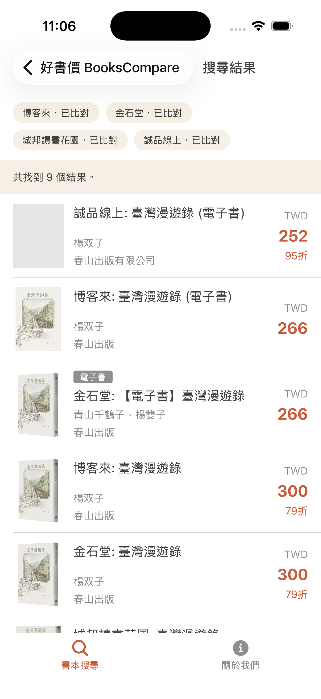

<p align="center">
  
</p>

<h1 align="center">好書價 BooksCompare</h1>

<p align="center">
  <strong>一鍵比價台灣四大網路書店的 iOS App。</strong>
</p>

<p align="center">
  掃描 ISBN 條碼或輸入書名，一次比較博客來、金石堂、城邦讀書花園、誠品線上的售價、折扣與電子書版本，挑出最划算的購書選擇。
</p>

<p align="center">
  <a href="./LICENSE.md">
    
  </a>
  <a href="https://bookscompare.mmc.dev">
    
  </a>
</p>

好書價是專為台灣讀者打造的書本比價 App。不需要註冊帳號、不會把你導到莫名其妙的廣告頁，只做一件事：在博客來、金石堂、誠品線上、城邦讀書花園之間，幫你找出最便宜的那一本書。

整個專案以 monorepo 形式管理，包含 iOS 行動 App、提供比價結果的 Cloudflare Workers API，以及兩端共用的 TypeScript 型別。

## 為什麼要做好書價

- **四大書店一次比完** — 不必再開四個網頁慢慢翻價錢，幾秒內看到實體書與電子書版本。
- **ISBN 條碼掃描** — 在書店架上看到喜歡的書，打開鏡頭掃條碼就能查到所有通路的最新售價。
- **繁體中文、台灣優先** — 介面、資料來源與售價都以台灣讀者為中心，所有金額以新台幣呈現。
- **隱私為先** — 不需要註冊，不收集個人可識別資料，只使用匿名分析來改善體驗。

## 介面預覽

實際 App 的截圖，幫助你在下載前快速感受好書價的樣貌。

<table>
  <tr>
    <td width="33%" valign="top">
      
      <p>
        <strong>掃條碼或輸入書名</strong><br />
        首頁直接輸入 ISBN，或開啟相機掃描書本條碼。
      </p>
    </td>
    <td width="33%" valign="top">
      
      <p>
        <strong>四大通路售價一目了然</strong><br />
        一次列出實體書與電子書版本，清楚標示原價、折扣與最終售價。
      </p>
    </td>
    <td width="33%" valign="top">
      
      <p>
        <strong>清爽乾淨，專注比價</strong><br />
        簡潔的關於頁面，提供條款、隱私政策與意見回饋入口。
      </p>
    </td>
  </tr>
</table>

## 下載

**[在 App Store 下載好書價](https://bookscompare.mmc.dev)**（即將上架，敬請期待）

- 支援 iOS 17 以上的 iPhone
- iPad 與 Android 版本規劃中
- 一次性付費，下載即可使用全部功能，終身享有後續更新

更多介紹與常見問題請參考 **[bookscompare.mmc.dev](https://bookscompare.mmc.dev)**。

## 主要功能

- **四大書店比價** — 同步搜尋博客來、金石堂、城邦讀書花園、誠品線上。
- **ISBN 條碼掃描** — 內建相機掃描，免去手動輸入長串數字。
- **書名快速搜尋** — 記不住 ISBN 也沒關係，輸入關鍵字即可比價。
- **電子書版本顯示** — 同時呈現實體書與電子書，並標註「電子書」徽章。
- **原生跳轉購買** — 看到中意的價格，可直接在 App 內跳到該書店原始頁面下單。
- **繁體中文介面** — 依系統語言自動切換繁體中文與英文。
- **暗色模式** — 跟隨系統主題切換。

## 技術概觀

好書價的程式碼採用 monorepo 結構：

```txt
apps/
  api/        # Cloudflare Worker(Wrangler)，負責爬資料與比價 API
    src/
      lib/        # ISBN、HTML、fetch、回應、log 等 helpers
      providers/  # 各書店查詢 provider 與註冊表
      services/   # 以 ISBN / 書名查詢的服務層,負責 fan-out
      sources/    # 各書店的爬蟲與來源轉接器
      index.ts
  mobile/     # Expo SDK 54 iOS-first App
    src/
      analytics/  # PostHog 串接
      api/        # API client
      components/
      i18n/       # zh-TW / en 翻譯字串
      lib/
      navigation/ # React Navigation stacks/tabs
      screens/    # 首頁、關於、共用畫面
      theme/
packages/
  contracts/  # 兩端共用 TypeScript 型別 (BookOffer, LookupResponse, ApiErrorResponse, ...)
```

### API

- **執行環境**：Cloudflare Workers（透過 Wrangler 部署，無框架，純 `fetch` handler）。
- **支援來源**：博客來（`books-com-tw`）、金石堂（`kingstone`）、城邦讀書花園（`cite`）、誠品線上（`eslite`）。
- **端點**：
  - `GET /` — 服務簡介
  - `GET /health` — 健康檢查
  - `GET /isbn/:id`、`GET /book/isbn/:id` — ISBN 查詢
  - `GET /search?q=<title>` — 書名搜尋（最多 100 字）
- **流量限制**：`ISBN_LIMITER` 綁定，每個 IP 每 10 秒最多 10 次請求；`isbn:` 與 `search:` 各自獨立計數。
- **快取**：成功的查詢結果會寫入 Workers 預設快取（`s-maxage=1800`），回應透過 `x-bookscompare-cache: HIT|MISS` 表示來源；任一來源 `status === 'error'` 時不會快取。
- **測試**：使用 Node.js 內建 test runner 搭配 `tsx` 執行。

### Mobile

- **框架**：Expo SDK 54、React Native 0.81、React 19。
- **導覽**：React Navigation（native-stack + bottom-tabs）。
- **資料**：TanStack React Query。
- **UI**：React Native Paper、`@expo/vector-icons`、`@expo/react-native-action-sheet`。
- **相機 / 條碼**：`expo-camera`。
- **WebView**：`react-native-webview`。
- **多語系**：`expo-localization`，繁體中文與英文。
- **分析**：`posthog-react-native`。
- **測試**：Jest、`jest-expo`、`@testing-library/react-native`。
- **環境變數**：`EXPO_PUBLIC_API_BASE_URL` 指向 API（預設 `http://localhost:8787`）。

### Contracts

- 純 TypeScript 型別套件，沒有任何 runtime 相依。
- 主要匯出：`BOOK_SOURCES`、`BookSourceId`、`BookOffer`、`SourceState`、`LookupQuery`、`LookupResponse`、`ApiErrorResponse`。
- 錯誤代碼：`INVALID_ISBN | INVALID_QUERY | METHOD_NOT_ALLOWED | NOT_FOUND | RATE_LIMITED`。

## 開發

> **注意**：本段適用於想參與開發的人，只想使用好書價請直接[下載 App](#下載)。

### 環境需求

- Node.js 20 以上
- pnpm 9.15.0（已透過 `packageManager` 鎖定版本）
- Xcode / CocoaPods（執行 iOS 原生流程時需要）

### 安裝相依

```bash
pnpm install
```

### 本機開發

在一個終端機啟動 Cloudflare Worker：

```bash
pnpm dev:api          # http://localhost:8787
```

在另一個終端機啟動 Expo 開發伺服器（先複製 `apps/mobile/.env.example` 為 `.env`）：

```bash
pnpm dev:mobile
```

直接在 iOS 模擬器執行：

```bash
pnpm ios:mobile
```

### 常用指令

```bash
pnpm typecheck        # 全 workspace 型別檢查
pnpm lint             # ESLint
pnpm lint:fix         # ESLint 自動修正
pnpm format           # Prettier
pnpm test             # API 測試 (tsx --test)
pnpm test:mobile      # Mobile 測試 (Jest)
pnpm check:api        # Wrangler 部署 dry-run
pnpm verify           # typecheck + lint + tests + worker check
pnpm deploy:api       # 部署 API 到 Cloudflare Workers
```

## 開發守則

- 所有套件皆使用 TypeScript 並啟用 strict mode。
- 共用的 API 回應型別一律放在 `packages/contracts`，避免在 app 之間重複定義。
- 來源 ID 必須對齊 `BOOK_SOURCES`（`books-com-tw`、`kingstone`、`cite`、`eslite`）。
- API 僅支援 `GET`，其他方法一律回傳 `METHOD_NOT_ALLOWED`。
- 行動 App 以 iOS 為優先，Android 設定保留以利後續推進。

更多架構與貢獻細節請參考 [CLAUDE.md](./CLAUDE.md)。

## 貢獻

歡迎提交 issue 與 pull request。如果想提案新功能、回報問題或改善某個書店的擷取邏輯，請先到 [GitHub issues](https://github.com/andrewmmc/bookscompare/issues) 提供足夠的重現資訊。

## 作者

由 **Andrew Mok** 製作（[@andrewmmc](https://github.com/andrewmmc)）。

## 免責聲明

好書價是獨立的開源專案，與博客來、金石堂、城邦讀書花園、誠品線上等網路書店均無任何隸屬、合作或贊助關係。所有商標屬於其原始持有者，引用僅為描述用途。售價以各書店官方網站為準，App 僅彙整公開資料供讀者參考。

## 授權

[MIT License](./LICENSE.md)。
